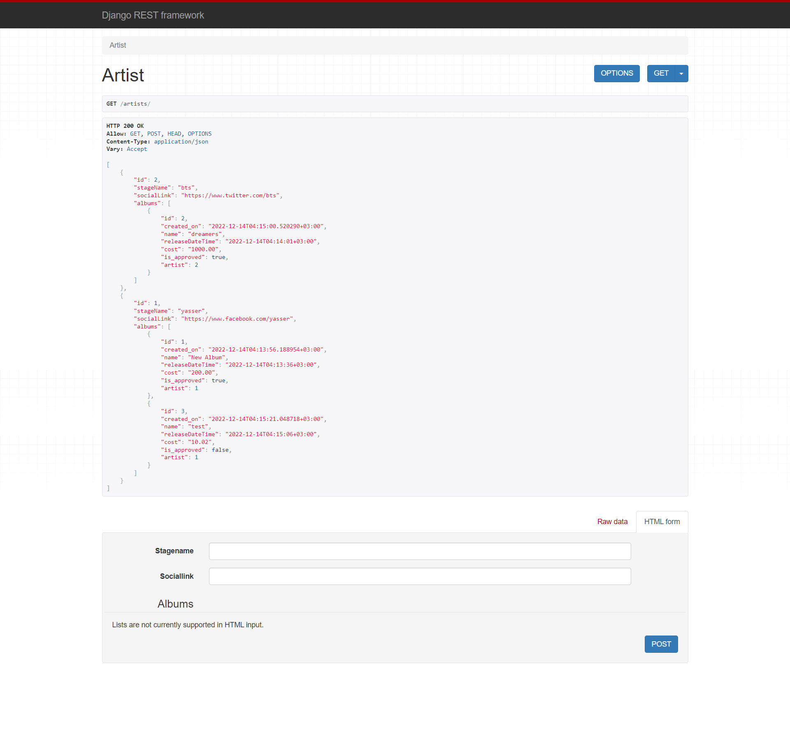

## **_*Class-based Views, User class, Authentication*_**

  - Changed all the current views to class based views, from now on we'll only be creating class based views 
    ```python
    from django.views import View

    class ListAlbum(View):
      pass
    ```

  - Added a sign in page(login, register and logout) using which a user can provide their username and password to get authenticated
    - created authentication app
      - [edit views](https://github.com/yaaa3ser/9_tasks-BLD_backend/blob/task4%2C5/authentication/views.py)
      - [edit urls](https://github.com/yaaa3ser/9_tasks-BLD_backend/blob/task4%2C5/authentication/urls.py)
    - created ```auth``` in templates
      - [edit login.html](https://github.com/yaaa3ser/9_tasks-BLD_backend/blob/task4%2C5/templates/auth/login.html)
      - [edit logout.html](https://github.com/yaaa3ser/9_tasks-BLD_backend/blob/task4%2C5/templates/auth/logout.html)
      - [edit register.html](https://github.com/yaaa3ser/9_tasks-BLD_backend/blob/task4%2C5/templates/auth/register.html)

  - Made unauthenticated users can access the endpoint https://localhost:8000/artists/, but only authenticated users can access the creation form pages
    - [edit view in artists](https://github.com/yaaa3ser/9_tasks-BLD_backend/blob/task4%2C5/artists/views.py)

  - We received a requirement that each album must have at least one song. In the albums app, create a song model that consists of: A name (if no name is provided, the song's name defaults to the album name)
    - created the Song model and add a signal in albums views
    ```python
      @receiver(pre_save, sender=Song)
      def song_pre_save(sender, instance, **kwargs):
          if instance.name =='':
              album = instance.album
              instance.name = album.name
    ```
      - [edit models in albums](https://github.com/yaaa3ser/9_tasks-BLD_backend/blob/task4%2C5/albums/models.py)
      - [edit views in albums](https://github.com/yaaa3ser/9_tasks-BLD_backend/blob/task4%2C5/albums/views.py)

====================================================================================================================

## **_*Django REST Framework*_**

  - created DRF's generic views and DRF's ModelSerializer
  - the path /artists/ returns a list of artists in JSON format for GET requests,
    - [edit artists serializers](https://github.com/yaaa3ser/9_tasks-BLD_backend/blob/task4%2C5/artists/serializers.py)
    - [edit artists views](https://github.com/yaaa3ser/9_tasks-BLD_backend/blob/task4%2C5/artists/views.py)
    - [edit artists urls](https://github.com/yaaa3ser/9_tasks-BLD_backend/blob/task4%2C5/artists/urls.py)
    
    - 

    
